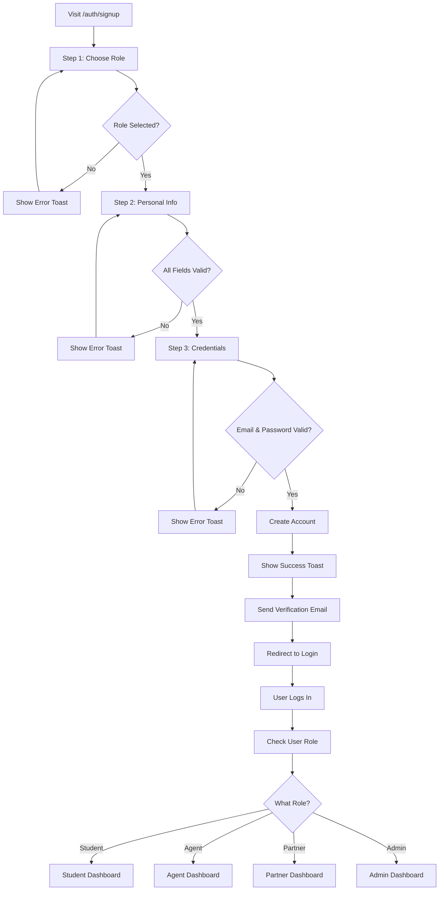

# Visual Guide: New Signup Flow

## 🎨 Design Overview

The new signup experience features a beautiful, modern multi-step form with smooth animations and intuitive navigation.

---

## Step-by-Step Visual Breakdown

### 📍 Step 1 of 3: Choose Your Role

```
╔═══════════════════════════════════════════════════════════════╗
║                      [Progress Bar: 33%]                       ║
╠═══════════════════════════════════════════════════════════════╣
║                                                                 ║
║                          [UniDoxia Logo]                            ║
║                                                                 ║
║                        Join UniDoxia                                ║
║           Step 1 of 3: Choose Your Role                       ║
║                                                                 ║
║   ┌─────────────────────┐  ┌─────────────────────┐           ║
║   │       🎓            │  │       💼            │           ║
║   │     Student         │  │      Agent          │           ║
║   │                     │  │                     │           ║
║   │ Apply to            │  │ Help students with  │           ║
║   │ universities and    │  │ their applications  │           ║
║   │ track applications  │  │ and earn commission │           ║
║   │                  ✓  │  │                     │           ║
║   └─────────────────────┘  └─────────────────────┘           ║
║                                                                 ║
║   ┌─────────────────────┐  ┌─────────────────────┐           ║
║   │       🏛️            │  │       ⚙️            │           ║
║   │     Partner         │  │      Admin          │           ║
║   │                     │  │                     │           ║
║   │ Manage university   │  │ Full system access  │           ║
║   │ partnerships and    │  │ and management      │           ║
║   │ applications        │  │ capabilities        │           ║
║   │                     │  │                     │           ║
║   └─────────────────────┘  └─────────────────────┘           ║
║                                                                 ║
║                      [Next →]                                  ║
║                                                                 ║
║                 ─────── Or continue with ───────               ║
║                      [Google Sign Up]                          ║
║                                                                 ║
║      Already have an account? Sign in                          ║
╚═══════════════════════════════════════════════════════════════╝
```

**Features:**
- 4 interactive role cards with hover effects
- Visual icons for each role
- Clear descriptions
- Checkmark appears on selected role
- Smooth scale animation on hover
- Primary action button (Next)
- Alternative Google OAuth option

---

### 📍 Step 2 of 3: Personal Information

```
╔═══════════════════════════════════════════════════════════════╗
║                      [Progress Bar: 66%]                       ║
╠═══════════════════════════════════════════════════════════════╣
║                                                                 ║
║                          [UniDoxia Logo]                            ║
║                                                                 ║
║                        Join UniDoxia                                ║
║         Step 2 of 3: Personal Information                     ║
║                                                                 ║
║   👤 Full Name                                                 ║
║   ┌─────────────────────────────────────────────────────────┐ ║
║   │ John Doe                                                 │ ║
║   └─────────────────────────────────────────────────────────┘ ║
║                                                                 ║
║   📞 Phone Number                                              ║
║   ┌─────────────────────────────────────────────────────────┐ ║
║   │ +1 234 567 8900                                          │ ║
║   └─────────────────────────────────────────────────────────┘ ║
║                                                                 ║
║   🌍 Country                                                   ║
║   ┌─────────────────────────────────────────────────────────┐ ║
║   │ Select your country                              ▼      │ ║
║   └─────────────────────────────────────────────────────────┘ ║
║                                                                 ║
║                                                                 ║
║            [← Back]              [Next →]                      ║
║                                                                 ║
║      Already have an account? Sign in                          ║
╚═══════════════════════════════════════════════════════════════╝
```

**Features:**
- Icon labels for better UX
- Input validation in real-time
- Country dropdown with 30+ countries
- Back and Next navigation
- Clean, spacious layout

---

### 📍 Step 3 of 3: Account Credentials

```
╔═══════════════════════════════════════════════════════════════╗
║                      [Progress Bar: 100%]                      ║
╠═══════════════════════════════════════════════════════════════╣
║                                                                 ║
║                          [UniDoxia Logo]                            ║
║                                                                 ║
║                        Join UniDoxia                                ║
║          Step 3 of 3: Account Credentials                     ║
║                                                                 ║
║   ✉️  Email Address                                            ║
║   ┌─────────────────────────────────────────────────────────┐ ║
║   │ john@example.com                                         │ ║
║   └─────────────────────────────────────────────────────────┘ ║
║                                                                 ║
║   🔒 Password                                                  ║
║   ┌─────────────────────────────────────────────────────────┐ ║
║   │ ••••••••                                            👁️  │ ║
║   └─────────────────────────────────────────────────────────┘ ║
║   Minimum 6 characters                                         ║
║                                                                 ║
║   🔒 Confirm Password                                          ║
║   ┌─────────────────────────────────────────────────────────┐ ║
║   │ ••••••••                                                 │ ║
║   └─────────────────────────────────────────────────────────┘ ║
║                                                                 ║
║                                                                 ║
║            [← Back]         [✓ Create Account]                ║
║                                                                 ║
║      Already have an account? Sign in                          ║
╚═══════════════════════════════════════════════════════════════╝
```

**Features:**
- Password visibility toggle (eye icon)
- Password confirmation field
- Minimum length helper text
- Final submission button with check icon
- Email format validation

---

## 🎬 Animation Flow

```
Step 1 → Step 2 → Step 3
  ↓        ↓        ↓
 33%      66%     100%

[Fade In + Slide] → [Fade In + Slide] → [Fade In + Slide]
```

**Animation Details:**
- Progress bar smoothly fills
- Content fades in/out between steps
- Subtle slide transitions
- No jarring movements
- 500ms transition duration

---

## 🎨 Color Scheme

```
Primary Colors:
├─ Background: Gradient (bg → bg → accent/5)
├─ Cards: White/Dark with shadow-2xl
├─ Progress Bar: Primary gradient
├─ Buttons: Primary with hover effects
└─ Text: Foreground with muted variants

Interactive States:
├─ Hover: Scale 1.05, shadow-lg
├─ Selected: Border-primary, ring-2
├─ Loading: Spinning animation
└─ Disabled: Opacity 50%
```

---

## 📱 Responsive Breakpoints

| Device | Width | Card Width | Font Size |
|--------|-------|------------|-----------|
| Mobile | < 640px | 95% | Base |
| Tablet | 640-1024px | max-w-md | Base |
| Desktop | > 1024px | max-w-2xl | Base+ |

---

## ✨ User Experience Highlights

### 1. **Progressive Disclosure**
- Information requested in logical order
- Not overwhelming with too many fields at once
- Each step has clear purpose

### 2. **Instant Feedback**
- Real-time validation
- Helpful error messages
- Success confirmations

### 3. **Flexibility**
- Can go back to previous steps
- Changes are preserved
- No data loss on navigation

### 4. **Accessibility**
- Keyboard navigation support
- Screen reader friendly
- High contrast support
- Touch-friendly targets

### 5. **Error Handling**
- Clear error messages
- Field-level validation
- Toast notifications
- No silent failures

---

## 🔄 Complete User Journey



---

## 🚀 Technical Implementation

### Components Used:
- ✅ `Card`, `CardHeader`, `CardContent`, `CardFooter`
- ✅ `Input` with custom styling
- ✅ `Label` with icons
- ✅ `Button` with loading states
- ✅ `Select` for country dropdown
- ✅ Custom progress bar
- ✅ Lucide React icons

### State Management:
- ✅ React useState for form data
- ✅ useAuth context for authentication
- ✅ useNavigate for redirects
- ✅ useToast for notifications

### Validation:
- ✅ Client-side form validation
- ✅ Email format checking
- ✅ Password length verification
- ✅ Password confirmation matching
- ✅ Required field checks

---

## 🎯 Success Criteria Met

- [x] Multi-step signup flow implemented
- [x] Role selection with visual cards
- [x] Phone and country fields added
- [x] Smooth animations and transitions
- [x] Role-based redirect after login
- [x] Database schema updated
- [x] Professional modern design
- [x] Mobile responsive
- [x] Accessible and keyboard friendly
- [x] Error handling and validation
- [x] Loading states and feedback
- [x] Build passing with no errors

---

## 📝 Quick Start Guide

### For New Users:

1. **Visit**: Navigate to `/auth/signup`
2. **Choose**: Select your role type
3. **Fill**: Enter your personal details
4. **Create**: Set up your credentials
5. **Verify**: Check your email
6. **Login**: Sign in with your credentials
7. **Explore**: Start using your role-specific dashboard

### For Developers:

```bash
# View the signup page
npm run dev
# Open http://localhost:5173/auth/signup

# Apply database migration
supabase db push

# Test different roles
# Create accounts with different roles and verify redirects
```

---

**Design System**: Tailwind CSS + Shadcn/ui  
**Framework**: React 18 + TypeScript  
**Authentication**: Supabase Auth  
**Status**: ✅ Production Ready
